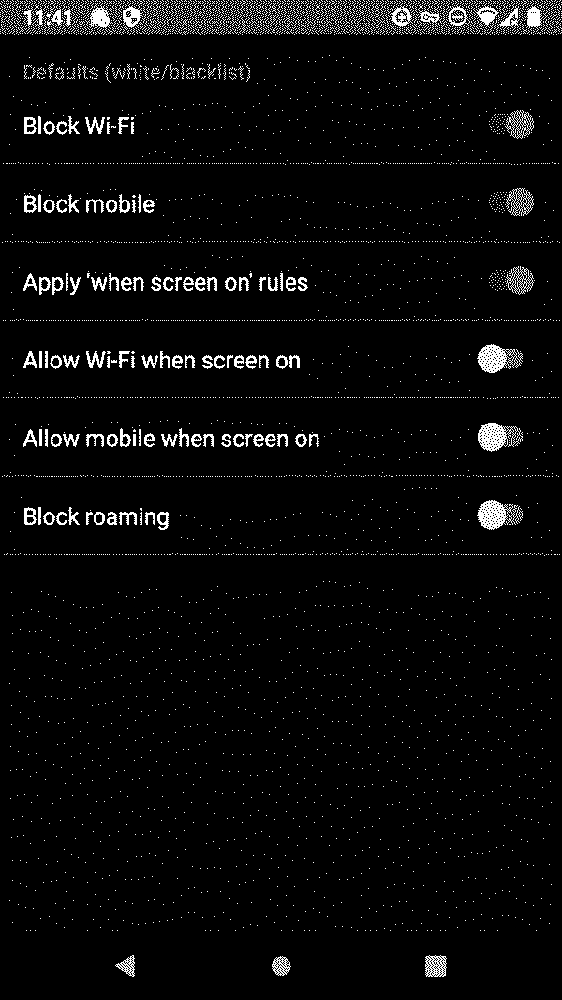
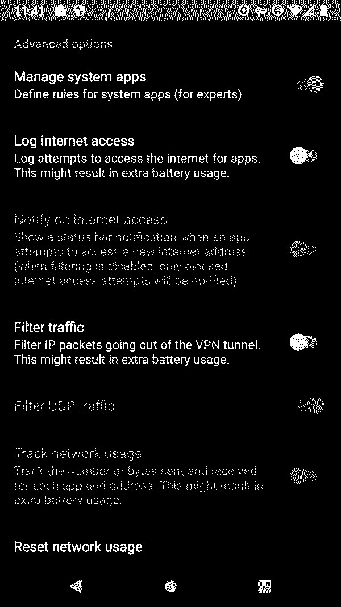

**Requirements**:

- Rooted system

---

On Android 11/Lineage OS 18.1, processes still get unrestricted network access (Wi-Fi and mobile data) per default.
Depending on the apps you use, this activity may send all kinds of data to Google or other third parties.

Android's user settings are cumbersome to maintain and do not allow low-level system services to be restricted.

[AFWall+](https://f-droid.org/en/packages/dev.ukanth.ufirewall/) is a firewall that modifies the system's `iptables`, hence the root requirement.
It allows you to precisely control which apps, including system-level services, get access to which internet connection interface, e.g. Wi-Fi, mobile, VPN, roaming, etc.

[Kuketz](https://www.kuketz-blog.de/afwall-digitaler-tuervorsteher-take-back-control-teil4/) (German) describes *AFWall+*'s usage in detail, though the interface is pretty self-explanatory.
User apps may be blocked freely to your liking.
Regarding system services, Kuketz suggests the following to be whitelisted in order to maintain basic system functionality:

- Updater
- (root) - Apps running as root
- (ntp) - Internet time servers
- com.android.providers.media, Download Manager, Downloads, MTP Hosts, Sounds

### Alternative for unrooted systems: *NetGuard*

[NetGuard](https://f-droid.org/en/packages/eu.faircode.netguard/) is a rootless firewall.
It acts as a VPN, so you would not be able to use another VPN service.

In *NetGuard*'s settings, enable *Block Wi-Fi* and *Block mobile* per default, and then enable each single app's network access manually in the main menu.

#### Manage system apps

If you dare, enable *Advanced options -> Manage system apps* to include system services under your control.

I am still experimenting myself with this option,
but it seems that you should be fine with allowing network access for these system services (and their correlates):

- Android System
- CaptivePortalLogin
- DNS daemon
- Network manager
- Tethering
- Updater
- com.android.server.NetworkPermissionConfig
- root

This still leaves a bunch of weird low-level services without unnecessary network access.

Note that some services can only be managed together as correlates.
For example restricting *Android System* restricts a set of other system services as well.

