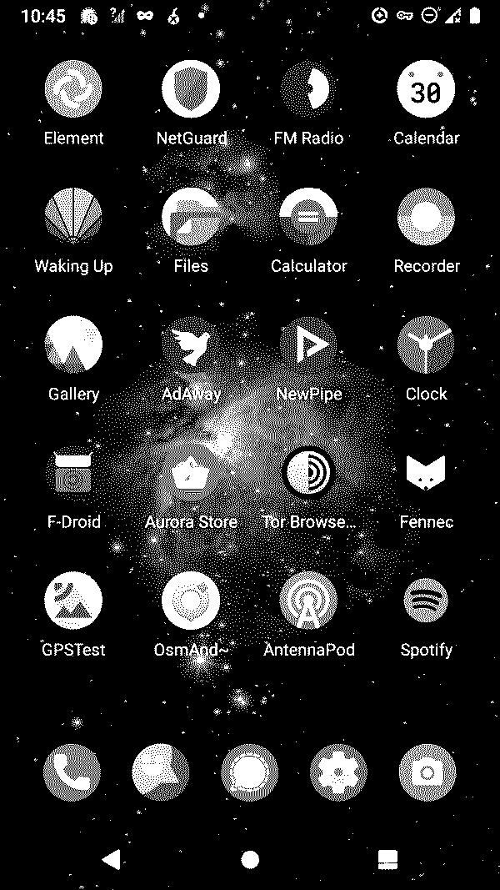

## Introduction

[LineageOS](https://lineageos.org/) is an open-source derivative of Google's Android Open Source Project (AOSP).
It is pretty lean and comes out of the box without all the crapware of the big smartphone vendors, which means: *almost* no tracking by third parties.

Google is still nosing around, though, so it needs a few tweaks before you can call it a true private OS.
This is a comprehensive step-by-step guide to do so.
Part of it is an English translation of the excellent [Kuketz-Blog](https://www.kuketz-blog.de/android-ohne-google-take-back-control-teil1/) (German).

If you follow the steps below on a vanilla *LineageOS 18.1* without MicroG, you will achieve feature parity with [/e/OS](https://doc.e.foundation/what-s-e#degoogling--ungoogling).
Check out their whitepaper regarding details.

### Content

1. [High-Level System Settings](system_settings)
  - Change system browser defaults
  - Disable phone number lookup
  - Change the Domain Name Server (DNS)
2. Helpful apps
  - [Domain Name Blocking with *AdAway*](host_blocker)
  - [Firewall with *AFWall+*](firewall)
3. Low-level system settings
  - [Captive Portal Server](captive_portal_server)
  - [Network Time Protocol (NTP) Server](ntp_server)
  - [SUPL for A-GPS](supl_agps)
  - [WebView with *Bromite*](webview)

### Requirements

... if you want to follow all steps:

1. [`adb` and `fastboot` set up on a host system](https://wiki.lineageos.org/adb_fastboot_guide.html)
2. [LineageOS 18.1 installed](https://wiki.lineageos.org/devices/)
3. ... and [rooted with *Magisk*](/rooting_lineageos)
4. Developer mode enabled by tapping build number 7 times in *Settings -> About phone -> Build number*)
5. Options enabled in *Settings -> System -> Advances -> Developer options*:
  - *USB debugging*
  - *Rooted debugging*

### Steps to repeat after each system upgrade

- [Rooting with *Magisk*](/rooting_lineageos)
  - ... and re-enable *AFWall+* firewall.
- [Network Time Protocol (NTP) Server](ntp_server)
- [SUPL for A-GPS](supl_agps)

### Notes

- Tested on vanilla *LineageOS 18.1* (no MicroG) on a *Fairphone 2*. It should also work for other devices and probably earlier versions of *LineageOS*, also with MicroG.
- No guarantee for comprehensiveness or correctness. Documentation is spotty to say the least.
- Kudos:
  - [Kuketz-Blog: Android ohne Google: Take back control!](https://www.kuketz-blog.de/android-ohne-google-take-back-control-teil1/) (German)
  - [Degoogling LineageOS instructions - August 2019 update](https://www.reddit.com/r/LineageOS/comments/cl5c90/degoogling_lineageos_instructions_august_2019/).

